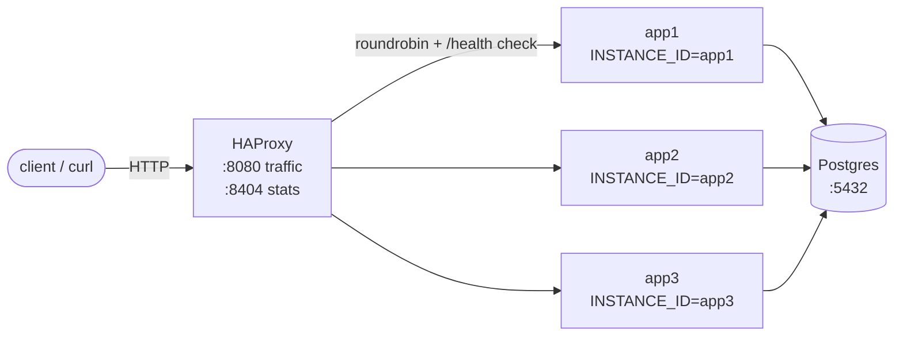
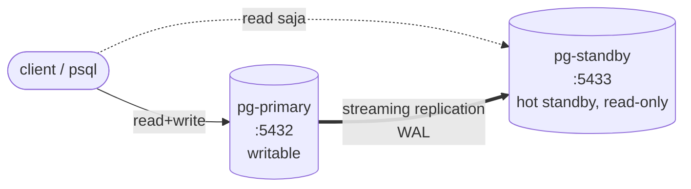
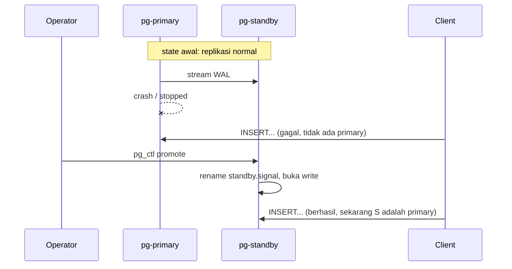

# Day-5 Demo — High Availability, Load Balancing, Failover

Dua demo terpisah, masing-masing fokus di satu layer supaya compose file tetap
kecil dan mudah dibaca:

| File                         | Layer             | Cakupan                            |
|------------------------------|-------------------|------------------------------------|
| `docker-compose.ha.yml`      | Aplikasi + LB     | 3 instance app, HAProxy, failover  |
| `docker-compose.pg-ha.yml`   | Database          | Primary + hot standby, failover    |

Keduanya pakai image dan skema tabel yang sama (`hello-db` Go + Postgres),
tapi **tidak dijalankan bersamaan**. Pilih satu sesuai topik yang dibahas.

---

## 1. App-tier HA + Load Balancing + Failover

### Topologi



Apa yang di-demo-kan di layer ini:

- **HA**: 3 instance app berjalan paralel. Matinya 1 instance tidak berarti
  service down — 2 yang lain menyerap traffic.
- **Load Balancing**: HAProxy membagi request round-robin. Client tidak tahu
  instance mana yang akan meng-handle request-nya.
- **Failover (health-check based)**: HAProxy probe `/health` tiap 2 detik.
  Instance yang gagal 2× berturut-turut di-flag DOWN dan dikeluarkan dari
  rotasi; saat pulih, masuk kembali.

### Cara menjalankan

```bash
cd sample-apps/hello-db
docker compose -f docker-compose.ha.yml up --build -d
```

Tunggu semua service `healthy`:

```bash
docker compose -f docker-compose.ha.yml ps
```

### Observasi load balancing

Setiap response membawa header `X-Instance-Id` — ditambahkan oleh middleware
di [`main.go`](./main.go). Headernya lolos melewati HAProxy.

```bash
for i in $(seq 1 6); do
  curl -sSI http://localhost:8080/whoami | grep -i x-instance-id
done
```

Expected output:

```
x-instance-id: app1
x-instance-id: app2
x-instance-id: app3
x-instance-id: app1
x-instance-id: app2
x-instance-id: app3
```

Endpoint `/whoami` juga mengembalikan JSON:

```bash
curl -sS http://localhost:8080/whoami | jq
# { "instance": "app2", "servedAt": "2026-04-24T01:45:12.123Z" }
```

`INSTANCE_ID` di-set via env var di compose — **tidak di-persist ke DB**.
Sifatnya ephemeral: container diganti, ID bisa berubah (atau sama saja kalau
operator men-set ulang).

### Observasi failover

Matikan salah satu instance:

```bash
docker compose -f docker-compose.ha.yml stop app2
```

Tunggu ~6 detik (2 detik probe × 2 fails berturut-turut + buffer), lalu ulangi
request:

```bash
for i in $(seq 1 6); do
  curl -sS http://localhost:8080/whoami | jq -r .instance
done
# app1 app3 app1 app3 app1 app3
```

HAProxy otomatis skip `app2`. Hidupkan kembali:

```bash
docker compose -f docker-compose.ha.yml start app2
```

~6 detik (probe × 2 success → rise) app2 masuk lagi ke rotasi.

### Stats page HAProxy

Buka di browser: `http://localhost:8404/stats` (user: `admin`, pass: `admin`).

Halaman ini menampilkan:

- Status tiap backend (UP / DOWN)
- Request count, error count
- Active vs queued connections
- Bytes in/out per backend

Refresh tiap 5 detik. Saat demo failover, baris backend yang di-stop berubah
warna → bukti visual bahwa HAProxy melihat perubahan status.

### File yang relevan

- [`docker-compose.ha.yml`](./docker-compose.ha.yml) — definisi service
- [`haproxy.cfg`](./haproxy.cfg) — frontend, backend, resolver, stats
- [`main.go`](./main.go) — handler `/whoami`, middleware `X-Instance-Id`

### Tear down

```bash
docker compose -f docker-compose.ha.yml down -v
```

---

## 2. Postgres HA — Primary + Hot Standby + Manual Failover

### Topologi



Apa yang di-demo-kan di layer ini:

- **Streaming replication**: WAL dari primary di-stream ke standby via
  koneksi `replication` (role `replicator`). Di-bootstrap sekali oleh
  `pg_basebackup --write-recovery-conf`.
- **Hot standby**: standby menerima query `SELECT` (tidak harus menunggu
  failover untuk baca data).
- **Manual failover**: saat primary mati, operator men-jalankan
  `pg_ctl promote` di standby → standby berubah jadi writable primary baru.

### Cara menjalankan

```bash
cd sample-apps/hello-db
docker compose -f docker-compose.pg-ha.yml up -d
```

Tunggu kedua container `healthy`:

```bash
docker compose -f docker-compose.pg-ha.yml ps
```

Bootstrap standby butuh ~10-20 detik (pg_basebackup harus transfer initial
snapshot dari primary).

### Verifikasi replikasi

Tulis di primary → baca di standby:

```bash
# tulis
docker compose -f docker-compose.pg-ha.yml exec pg-primary \
  psql -U hello -d hellodb -c \
  "CREATE TABLE t(id int); INSERT INTO t VALUES (1),(2),(3);"

# baca — data sudah nyampe
docker compose -f docker-compose.pg-ha.yml exec pg-standby \
  psql -U hello -d hellodb -c "SELECT * FROM t ORDER BY id;"
```

Konfirmasi standby memang read-only:

```bash
docker compose -f docker-compose.pg-ha.yml exec pg-standby \
  psql -U hello -d hellodb -c "INSERT INTO t VALUES (99);"
# ERROR: cannot execute INSERT in a read-only transaction
```

Lihat status replikasi dari primary:

```bash
docker compose -f docker-compose.pg-ha.yml exec pg-primary \
  psql -U hello -d hellodb -c \
  "SELECT application_name, state, sync_state, client_addr FROM pg_stat_replication;"
```

Kolom penting:

- `state=streaming` — koneksi WAL aktif
- `sync_state=async` — default; tidak menunggu ack standby sebelum commit

### Demo manual failover

Skenario: primary crash, operator harus promote standby supaya service tetap
menerima write.



Langkah:

```bash
# 1. matikan primary
docker compose -f docker-compose.pg-ha.yml stop pg-primary

# 2. promote standby jadi primary baru
docker compose -f docker-compose.pg-ha.yml exec -u postgres pg-standby \
  pg_ctl promote -D /var/lib/postgresql/data
# Output: "server promoted"

# 3. standby sekarang writable
docker compose -f docker-compose.pg-ha.yml exec pg-standby \
  psql -U hello -d hellodb -c "INSERT INTO t VALUES (42); SELECT * FROM t ORDER BY id;"
```

Setelah promote, standby **tidak bisa dibalik jadi standby lagi** otomatis —
butuh re-bootstrap via `pg_basebackup` baru dari primary yang hidup. Ini
pola umum: failover itu satu-arah, untuk balik ke topologi asli butuh
operasi eksplisit (sering disebut "failback").

### Batasan demo ini

- **Manual, bukan otomatis**. Di produksi dipakai alat seperti
  [Patroni](https://github.com/patroni/patroni), `pg_auto_failover`, atau
  leader-election berbasis etcd/Consul.
- **Tidak ada VIP / connection routing otomatis**. Aplikasi masih hard-code
  `DB_HOST=pg-primary`. Saat failover, butuh ganti config aplikasi atau
  tambah proxy (PgBouncer, HAProxy, Pgpool-II).
- **Async replication**. Write yang sudah commit di primary bisa hilang
  kalau primary crash sebelum WAL sampai ke standby. Untuk zero data loss
  pakai `synchronous_commit=on` + `synchronous_standby_names`.

### File yang relevan

- [`docker-compose.pg-ha.yml`](./docker-compose.pg-ha.yml) — primary + standby
- [`pg-ha/primary-init.sh`](./pg-ha/primary-init.sh) — bikin role replicator,
  tambah pg_hba
- [`pg-ha/standby-entrypoint.sh`](./pg-ha/standby-entrypoint.sh) — bootstrap
  via `pg_basebackup` kalau data dir kosong

### Tear down

```bash
docker compose -f docker-compose.pg-ha.yml down -v
```

---

## Latihan

1. **Zero-downtime deploy**. Dengan stack app-tier up, rebuild app image
   (edit `main.go`, `docker compose -f docker-compose.ha.yml up -d --build app1`).
   Amati di stats HAProxy: saat app1 restart, trafik kontinu dilayani app2/app3.
2. **Kill yang tidak bersih**. `docker compose kill app3` (SIGKILL, bukan
   stop). Berapa detik sampai HAProxy menandainya DOWN? Bandingkan dengan
   `stop`. Kenapa beda?
3. **Ubah health check jadi `/ready`** di `haproxy.cfg`. Stop container `db`
   (pakai `docker compose -f docker-compose.ha.yml stop db`). Apa yang
   terjadi? Apakah semua app ditandai DOWN oleh LB? Diskusikan kenapa
   liveness vs readiness penting untuk health-check LB.
4. **Lag replikasi buatan**. Di pg-primary, tulis banyak data:
   `INSERT INTO t SELECT generate_series(1, 1000000);`. Sambil jalan,
   query di pg-primary: `SELECT pg_wal_lsn_diff(pg_current_wal_lsn(),
   replay_lsn) AS lag_bytes FROM pg_stat_replication;`.
   Amati angka naik → turun.
5. **Failback**. Setelah pg-primary mati + pg-standby di-promote, buat
   node baru untuk jadi standby dari primary baru. Hint: perlu
   `pg_basebackup` dari node yang sekarang primary, dan update
   `primary_conninfo` di node lama (atau re-init dari kosong).
